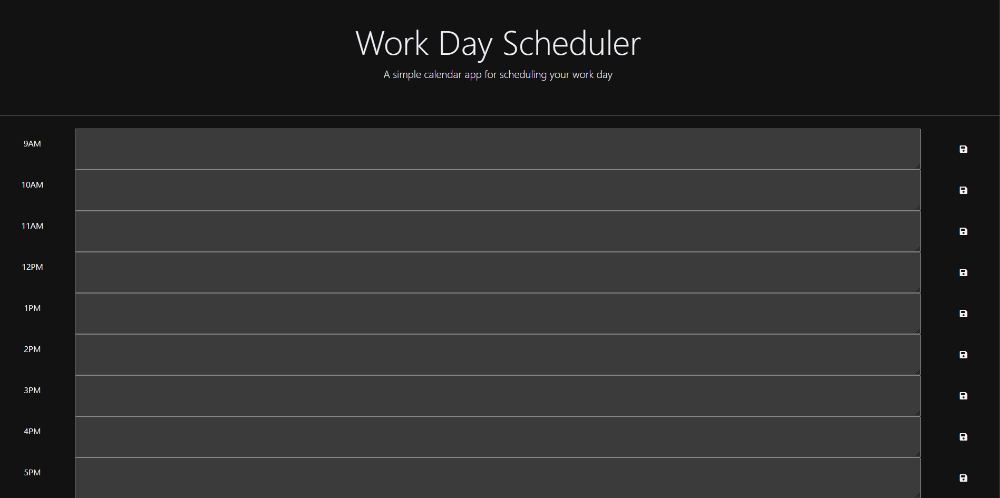

# Work Day Scheduler Starter Code

This application is designed to keep track of what needs to get done during a work day. Will help manage your time.

## Usage
The user will input what they would like to get done in the hour time slot.
They will then click the save button.
The box will change from green, to red, to gray.
Green for the hour having not yet passed.
Red for the current hour.
Gray is for passed the hour.
If the page is refreshed the information should be saved in local storage. 

## Screenshot

## License

[MIT](https://choosealicense.com/licenses/mit/)

##Contact

GitHub: [My Profile] https://github.com/Cfrog5
